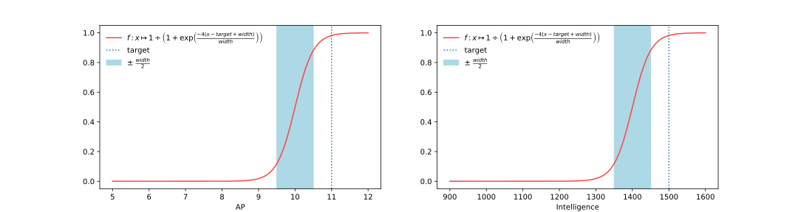
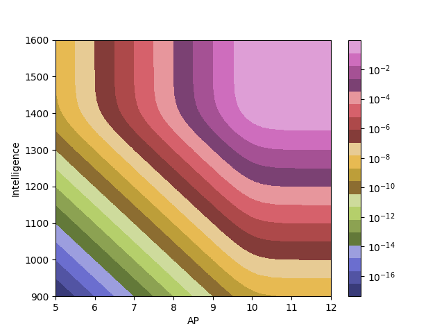

Dofus Generate Stuff
====================

[](https://travis-ci.com/remi-dupre/dofus-generate-stuff)

Generate Dofus stuffs based on input requirements using a randomized local
search. Note that its mainly built with the intend to interface it in an
external front end.


Installation
------------

### From releases

Automatic releases are published *for linux 64 bits*
[on GitHub](https://github.com/remi-dupre/dofus-generate-stuff/releases), you
can download an archive containing both the binary and required item databases.

```
wget https://github.com/remi-dupre/dofus-generate-stuff/releases/download/${VERSION}/dofus-generate-stuff.tar.gz
tar -xf dofus-generate-stuff.tar.gz
cd dofus-generate-stuff
./stuffer examples/earth_iop.json
```

### From sources

The only requirement is the Rust compilation toolchain, you can find
informations on how to install it from the
[official website](https://www.rust-lang.org/tools/install).

First, clone the repository.

```bash
git clone https://github.com/remi-dupre/dofus-generate-stuff.git
```

You will need to download a database of the equipment by using the command
bellow. Alternatively you may want to avoid waiting a few hours until this is
done and extract these files from an existing release (cf. previous section)
and put them in a directory called `data`.

```bash
./download_data.sh  # download informations about equipments
```

Once you downloaded data files, you can compile and run with a single cargo
command:

```bash
cargo run --release -- examples/earth_iop.json
```


Usage
-----

You can launch the program and specify a target configuration:

```bash
./stuffer examples/target_file.json # if you installed via releases
cargo run --release -- examples/target_file.json # if you installed from sources
```

### Input file

All specifications about the desired stuff are put in the JSON file specified
as input. Here is the list of supported fields:

| key            | description                                                 | default |
|----------------|-------------------------------------------------------------|---------|
| `level`        | level of the character (affects carac points and item pool) | 200     |
| `banned_types` | list of item kinds to ban                                   | []      |
| `target`       | list of approximate target values desired in the output     | []      |

#### Target

The field `target` is formatted as a list of pairs `[target_kind,
target_value]`. For example, someone who wants to build an annoying tanky build
for his feca may target the following kind of statistics:

```json
{
    "level": 200,
    "target": [
        ["Resiliance", 10000],
        [{"Carac": "Lock"}, 150],
        [{"Carac": "AP"}, 11],
        [{"Carac": "MP"}, 6],
        [{"PowStats": "Air"}, 800],
        [{"Carac": "MP Resistance"}, 70],
        [{"Carac": "AP Resistance"}, 70],
        [{"Carac": "AP Reduction"}, 100]
    ]
}
```

Which will output this build:

  

The values defined in the input don't need to be accurate, but only to give an
order of magnitude of the value expected in the output. If the requirements are
too strong, the result may be less ambitious, if they are not strong enough,
the result may be better than specified.

The target kind can be:

 - `"Resiliance"`: the "effective" health points of the character by taking
   percent resistance into account: `resiliance = hp / (1 - mean_res)`.
 - `"PerResVariance"`: variance of percent resistances, this is useful to
   target a low value in order to get balanced resistances in the output.
 - `{"Carac": carac_kind}`: target a standard characteristic. These
   characteristics are listed [in the corresponding type](https://remi-dupre.github.io/dofus-generate-stuff/dofus_stuff/dofapi/enum.CaracKind.html#variants)
   but you will need to spell them in natural language as they appear in
   Dofus wiki (eg: `"Air Damage"` instead of `Damage(Air)`).
 - `{"PowStats": element}`: power + raw statistics for an element ("Air",
   "Fire", ...)
 - `{"MeanExtraDamage": element}`: damage + average critical damages for an
   element.
 - `{"MeanDamage": spell_effect}`: average damages of a spell, see
   corresponding section about how to format spell effects.

#### Spell Effects

For example,
[Ambush](https://www.dofus.com/en/mmorpg/encyclopedia/spells/details?id=13835&level=3&selector=1&wrapping=ak-wrapping-5dc96ce22aeaf)
can be formatted as follows:

```json
{
    "critical": 5,
    "ranged": true,
    "effect": [
        {"Hit": {"element": "Air", "bounds": [10, 12]}},
        {"Hit": {"element": "Earth", "bounds": [10, 12]}},
        {"Hit": {"element": "Fire", "bounds": [10, 12]}},
        {"Hit": {"element": "Water", "bounds": [10, 12]}}
    ],
    "critical_effect": [
        {"Hit": {"element": "Air", "bounds": [12, 14]}},
        {"Hit": {"element": "Earth", "bounds": [12, 14]}},
        {"Hit": {"element": "Fire", "bounds": [12, 14]}},
        {"Hit": {"element": "Water", "bounds": [12, 14]}}
    ]
}
```


How it works
------------

Here is a brief explanation of the underlying algorithms, which are as you will
see quite generalists and simple.

### Simulated annealing

The whole "stuff generation" process is handled by a generalist optimisation
method called [simulated annealing](https://en.wikipedia.org/wiki/Simulated_annealing).

Let's explain it with the actual generic implementation of this project:

```rust
pub fn rls<T, R, E, W>(init: T, steps: u32, rng: &mut R, eval: E, walk: W) -> T
where
    T: Clone + Sized,
    R: rand::Rng,
    E: Fn(&T) -> f64,
    W: Fn(T, &mut R) -> T,
{
    // `lambda` could be any number between 0 and 1.
    // I choose lambda such that lambda ** (0.75 * steps) == 1e-3.
    let lambda = (1e-3f64.ln() / (0.75 * f64::from(steps))).exp();
    let init_eval = eval(&init);

    let (ret, _eval) = (1..=steps)
        .map(|step| {
            lambda.powi(step.try_into().expect("`steps` must fit in a i32"))
        })
        .fold((init, init_eval), |(curr, curr_eval), threshold| {
            let new = walk(curr.clone(), rng);
            let new_eval = eval(&new);

            if new_eval > (1. - threshold) * curr_eval {
                (new, new_eval)
            } else {
                (curr, curr_eval)
            }
        });

    ret
}
```

First, let's have a look to the type of this function:

 - It outputs a type `T`, in our case we want it to represent a stuff.
 - As input it takes:
   - `init: T`: an initial stuff
   - `eval`, a function that takes a stuff as input and returns a float. `eval`
     will be our way to evaluate the interest we have in a given stuff.
   - `walk`, a function that takes a stuff as input and returns a new stuff.
     Also, this function takes some random generator as input so there will be
     randomisation going on there.

With the `walk` and `eval` functions, we have a way to walk randomly over
values of `T` (thus a sequence of stuffs), and keep the best of them. The
simulated annealing method is actually not much more complicated, we just
cancel a walk if it decrease the evaluation of the stuff by more than a factor
decreasing to 0 (`lambda ** step` in this case).

### Walk

The `walk` function need to be local, calling it only once may not change the
value of `eval` too much. That way, we can achieve finding a local maximum for
`eval`.

Currently the walk function acts as follows:

 1. Flip a coin.
 2. If it hits "tail", equip a random piece of equipement, and replace the
    already equiped one if needed. If it hits "head", invest in a
    characteristic (intelligence, vitality...).

### Eval

To evaluate if a characteristic is fine, I tried to find a function that would
be always increasing, and with a kind of continuous cut-off point at the
required value. To achieve this, I'm currently using sigmoids:



Then, the `eval` function can be computed by the product of all these sigmoids.
The result for the two previous axis would look like this:


